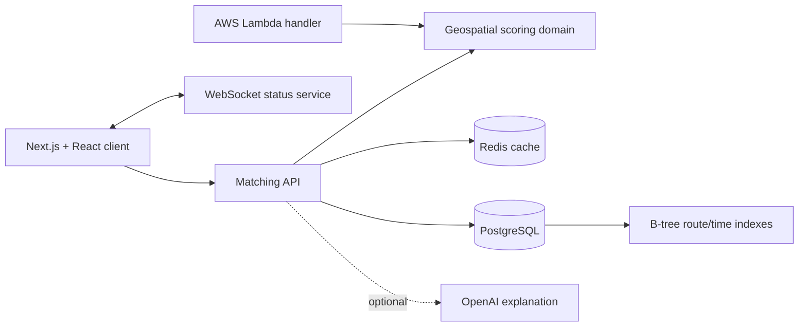

# ZotPool

ZotPool is a full-stack ridesharing prototype for the UCI community. It ranks compatible carpools using route proximity, departure-time alignment, available seats, and luggage capacity, then exposes trip-status events through a small WebSocket service.

> **Portfolio MVP:** the matching algorithm, API, PostgreSQL repository, Redis cache, WebSocket service, Docker environment, Lambda-compatible handler, optional OpenAI explanation adapter, tests, and CI are implemented. The public demo can use in-memory sample rides when infrastructure credentials are not configured. Production traffic, scale claims, and a live AWS deployment are not asserted by this repository yet.

## What works

- Google Maps place selection for pickup and destination.
- Haversine-distance route comparison with weighted preference scoring.
- Ranked matches with explainable score components.
- `POST /api/matches` Node.js/Next.js API.
- PostgreSQL repository with time-window lookup and explicit B-tree indexes.
- Redis-backed match caching with a 60-second TTL.
- WebSocket trip-status broadcast service.
- Docker Compose environment for the app, PostgreSQL, Redis, and realtime service.
- AWS SAM template and Lambda-compatible matching handler.
- Optional OpenAI Responses API explanations layered over deterministic rankings.
- Automated domain tests, type checking, build verification, and GitHub Actions CI.
- Clerk authentication when Clerk credentials are configured.

## Architecture



The matching domain is deliberately independent of the web framework. The Next.js API and Lambda handler both reuse the same scoring functions, while repository and cache interfaces allow in-memory demo adapters to be replaced by PostgreSQL and Redis without changing the algorithm.

## Matching model

Candidates must satisfy hard constraints for maximum detour radius, departure-time window, and seat capacity. Compatible rides are ranked with:

| Signal | Weight |
| --- | ---: |
| Pickup proximity | 35% |
| Destination proximity | 35% |
| Departure-time proximity | 20% |
| Luggage compatibility | 10% |

See [`src/domain/matching.ts`](src/domain/matching.ts) for the implementation and [`tests/matching.test.ts`](tests/matching.test.ts) for executable examples.

## Run locally

### Lightweight demo

The app falls back to in-memory rides and cache storage when service URLs are absent.

```bash
cp .env.example .env.local
npm install
npm run dev
```

Leave `DATABASE_URL` and `REDIS_URL` commented out for demo mode. Add a Google Maps browser key to `NEXT_PUBLIC_GOOGLE_MAPS_API_KEY`, then open `http://localhost:3000`. Setting `OPENAI_API_KEY` optionally enables a short AI-generated explanation of the deterministic ranking; matching works without it.

### Full local stack

```bash
cp .env.example .env
docker compose up --build
```

Services:

- Web app and matching API: `http://localhost:3000`
- API health/status: `http://localhost:3000/api/matches`
- Realtime health: `http://localhost:8081/health`
- PostgreSQL: `localhost:5432`
- Redis: `localhost:6379`

The PostgreSQL container automatically applies [`db/init/001_schema.sql`](db/init/001_schema.sql), including seed rides and B-tree indexes.

## Verify

```bash
npm test
npm run typecheck
npm run build
```

GitHub Actions runs the same checks for every pull request.

## Repository map

```text
app/api/matches/          HTTP matching API
app/carpool/              ride request interface
src/domain/               framework-independent matching logic
src/server/repositories/  PostgreSQL and demo repositories
src/server/cache/         Redis and in-memory caches
server/realtime.ts        WebSocket trip-status service
db/init/                  schema, seed data, and indexes
infra/                    AWS Lambda handler and SAM template
tests/                    matching-domain tests
```

## Roadmap

- Persist user-created ride requests and mutual confirmations.
- Deploy and benchmark the Lambda/PostgreSQL/Redis configuration.
- Add authenticated trip rooms and durable WebSocket event history.
- Expand the Travel Buddy workflow after the carpool MVP is stable.

## Project background

ZotPool began as a UCI hackathon project inspired by the cost and isolation of traveling alone. This repository now focuses on turning that prototype into a verifiable engineering portfolio project with clear boundaries between working code and planned production features.

## License

MIT
